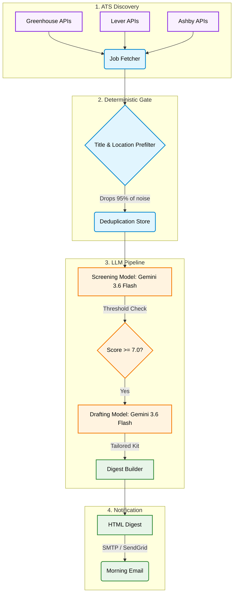

<div align="center">

# JobHunt - AI Job-Search Agent

**An automated, agentic job-search pipeline that pulls from ATS boards, prefilters noise, scores matches against your resume using LLMs, and drafts tailored cover letters.**

[](https://www.python.org/)
[](https://aistudio.google.com/)
[](https://github.com/features/actions)

</div>

---

## Overview

A personal job-search agent built as part of a project-based AI engineering curriculum to solve the high-noise problem of modern job hunting. The pipeline reads open postings directly from public ATS APIs (Greenhouse, Lever, Ashby) every morning, deterministically prefilters the 99% that are irrelevant based on regex/location rules, and then uses a two-stage LLM pipeline to score the remaining roles against a parsed resume. For the top matches, it automatically drafts an application kit including tailored bullets and a cover letter, finally emailing a clean digest. 

**Note: The system never auto-submits an application by design to avoid ATS blocking and spam. It acts strictly as an intelligent research and drafting assistant.**

---

## Architecture



---

## Key Features

- **Multi-ATS Integration**: Natively parses Greenhouse, Lever, and Ashby JSON endpoints, normalising different schemas, timezone bugs, and HTML-escaping quirks.
- **Two-Stage LLM Routing**: 
  - *Stage 1 (Screening)*: Uses a fast, cheap model (e.g., Gemini 3.6 Flash) to batch-score jobs out of 10 based on strict seniority and skill alignment.
  - *Stage 2 (Drafting)*: Uses a highly capable model (e.g., Gemini 3.6 Flash) to generate 150-word cover letters, tailored resume bullets, and interview questions exclusively for top-scoring roles.
- **Cost-Optimized Determinism**: Uses regex rules (`config.yaml`) to drop wrong seniority, functions, and locations before a single token is spent, keeping running costs below ₹5/day.
- **Local JSON Storage**: Maintains a local `seen.json` state to ensure jobs are never evaluated twice.
- **GitHub Actions Automation**: Designed to run statelessly on a cron schedule using GitHub Actions cache to persist the tracking store.

---

## Quick Start

### 1. Installation

```bash
git clone https://github.com/Shashank17singh/JobHunt.git
cd JobHunt
python -m venv .venv
.\.venv\Scripts\Activate.ps1
pip install -r requirements.txt
```

### 2. Configuration

Create your environment variables file:
```bash
cp .env.example .env
```
Add your `GEMINI_API_KEY` to `.env`.

### 3. Generate Your Profile

Pass your resume (.tex, .md, or .txt) to the agent so it can build your matching profile:
```bash
python -m jobhunt profile --resume JobHunt_Resume.tex
```
*This generates `profile.json`. Review and adjust it to ensure accurate matching.*

### 4. Run the Pipeline

```bash
# Run the pipeline with a safety limit to check filtering logic
python -m jobhunt run --limit 10

# Send the resulting digest to your email
python -m jobhunt run --send
```

---

## Tracking Applications

When you actually apply to a job from the digest, mark it as applied so the analytics tracker can map your funnel:

```bash
python -m jobhunt applied "greenhouse:stripe:5501001"
python -m jobhunt stats
```
This generates `out/tracker.csv` for use in Excel or Google Sheets.

---

## License

This project is licensed under the MIT License. See the [LICENSE](LICENSE) file for details.
